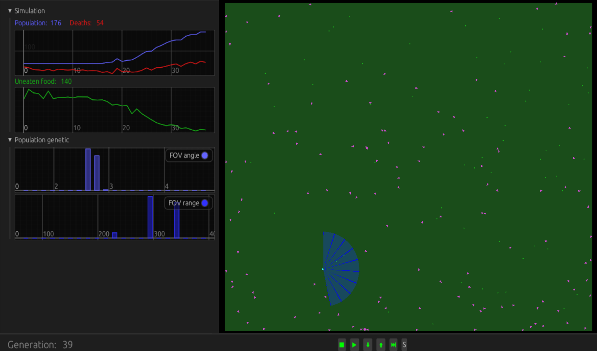

# Exelixi
Exelixi simulates the interaction of organisms with their environment and their reproductive evolution.

Each organisms can be composed of different 'parts', like eyes, brains with neurons, locomotion, which will help sense, compute and act in the environment. Each part can be more or less configurable through genes which are passed on to children when surviving. Each organism has an energy level and dies when it reaches 0, each part can consumes energy based on its configuration.

Different simulation configuration can be defined through ron-file, currently passed as command-line arguments.

A GUI allows to interact with the simulation and see some graphs.

## Dependencies

Exelixi is developped in the [Rust](www.rust-lang.org) programming language.

It uses the [Bevy game engine](www.bevyenging.org), its ECS for the core organism simulation, and all its features for the visualization and interactivity.